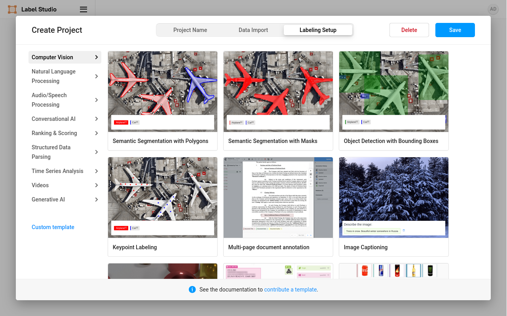
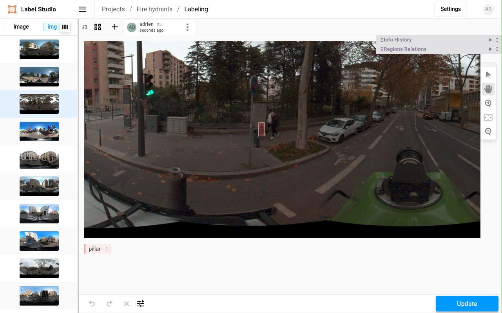
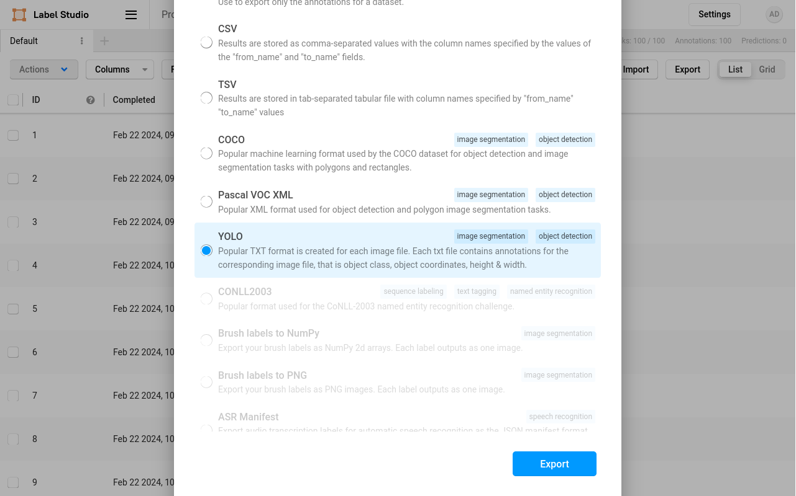
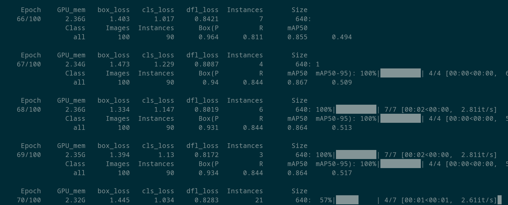
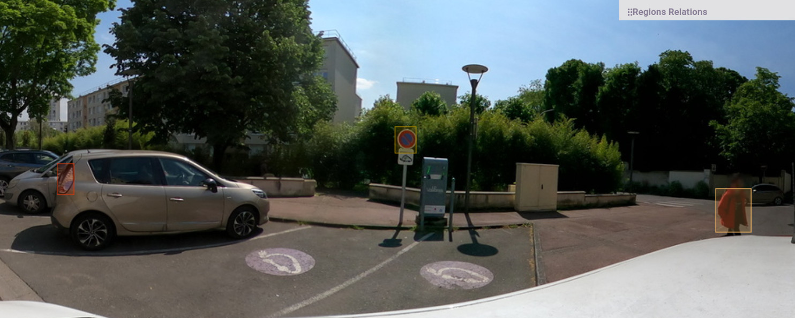

# 🖼️🤖 Tutoriel : détection automatique d'objets avec YOLO, Panoramax & OpenStreetMap !


Bienvenue sur ce tutoriel ! Celui-ci vous guidera dans la création d'un modèle sur-mesure de détection d'objets à l'aide des photos de rues provenant de Panoramax, et en utilisant YOLOv8 et Label Studio. Nous découvrirons ensemble comment :

- Trouver des localisations d'objets à détecter via [__OpenStreetMap__](https://www.openstreetmap.fr/)
- Récupérer des images exemples depuis [__Panoramax__](https://panoramax.fr)
- Annoter les images en utilisant [__Label Studio__](https://labelstud.io/)
- Entraîner un modèle de détection avec [__YOLOv8__](https://docs.ultralytics.com/fr)
- Détecter des objets dans les images Panoramax

Nous explorerons également le processus de ré-entraînement basé sur les faux positifs afin d'affiner le modèle. Le but est de vous rendre autonome sur la détection d'objets, de A à Z.

## 🌐 Vue d'ensemble

[YOLOv8](https://docs.ultralytics.com/), ou _You Only Look Once (version 8)_, est un algorithme de détection d'objets puissant, massivement utilisé dans le domaine de la _vision par ordinateur_ (_computer vision_). Il est particulièrement apprécié pour sa capacité à détecter et à classer rapidement des objets dans des images ou vidéos. YOLOv8 utilise un unique réseau neuronal pour prédire plusieurs classes d'objets et leur emplacement dans l'image.

L'annotation des images sera une étape clé pour bien détecter les objets. Le but est d'apprendre à l'algorithme à quoi ressemblent les objets recherchés. Nous devons expliquer à l'aide de nombreux exemples, que tel objet est par exemple une voiture, et qu'elle est à cet endroit de l'image. Pour ce faire, nous allons dessiner sur l'image des rectangles pour délimiter les objets, et nous attribuerons à chacun d'entre eux une étiquette (ou classe) pour distinguer les différents objets.

Mais pour pouvoir annoter les images, encore faut-il avoir un stock de photos avec des exemples d'objets à trouver. Nous utiliserons ici [OpenStreetMap](https://www.openstreetmap.org/) et [Panoramax](https://panoramax.fr/) pour trouver des photos pertinentes. OpenStreetMap (OSM) est un projet de cartographie collaboratif mondial, souvent surnommé le _Wikipedia des cartes_. Il s'agit d'une vaste base de données géographiques où des contributeurs du monde entier peuvent participer activement au recensement des nombreuses données cartographiques. OSM permet à chacun de contribuer facilement, ce qui en fait une ressource précieuse et particulièrement détaillée. Nous allons donc commencer par extraire la position des objets que nous recherchons dans OpenStreetMap, puis demander à Panoramax de nous fournir des photos montrant les objets en question.

Avec ce stock d'images exemples, nous allons pouvoir commencer l'annotation. [Label Studio](https://labelstud.io/) est un logiciel libre conçu pour les tâches d'étiquetage et d'annotation de données. Il s'agit d'un outil complet permettant d'étiqueter efficacement divers jeux de données (images, textes, fichiers audio) pour les modèles d'apprentissage automatique. Les données annotées seront ensuite exportées pour entraîner un modèle YOLO.

Avec le modèle entraîné par YOLO, nous pourrons effectuer des détections d'objets sur un grand nombre d'images, en utilisant les photos de Panoramax. Nous nous appuierons sur un script Python pour parcourir le catalogue, faire travailler le modèle YOLO, puis exporter les images intéressantes et un fichier GeoJSON listant les positions des images montrant les objets détectés.

Maintenant que vous avez une bonne vue d'ensemble, mettons les mains dans le cambouis !

## 📷🗺️ Trouver des images avec Panoramax & OpenStreetMap

### Localiser les objets recherchés avec OpenStreetMap

La première étape est de trouver des images avec les objets à rechercher, afin de pouvoir entraîner notre modèle. Dans ce tutoriel, nous allons chercher des __bornes incendie__ (_fire hydrants_) 🔥💧. Pour récupérer des localisations exemples de ces objets, nous nous appuierons sur les données d'OpenStreetMap. En particulier, nous utiliserons ici un outil nommé [Overpass Turbo](https://overpass-turbo.eu/), qui est un explorateur thématique de données OSM, facile à utiliser.

Le moyen le plus rapide d'obtenir les données souhaitées est d'utiliser le bouton __Assistant__. Dans la pop-up, tapez en anglais le type d'objet que vous recherchez, par exemple ici :

> "fire hydrant" in Lyon


Puis, cliquez sur _Construire et exécuter_. Les données vont appraître sur la carte :


Les données d'OpenStreetMap peuvent ensuite être exportées via le bouton __Exporter__. Enregistrez-les au format __GeoJSON__. Si vous avez le moindre souci pendant cette étape, un fichier exemple [`osm_hydrants_lyon.geojson`](./osm_hydrants_lyon.geojson) est également fourni avec le tutoriel.

### Télécharger les photos à proximité avec Panoramax

[L'API de Panoramax](https://panoramax.ign.fr/api/docs/swagger#/Pictures/get_api_search) propose une _route_ pour trouver les photos pointant sur une localisation précise. Vous pouvez l'appeler avec une requête _HTTP GET_:

```
https://panoramax.ign.fr/api/search?place_distance=2-10&place_position=4.8444928,45.7719378
```

Vous obtiendrez ainsi la liste des images montrant la position en question (longitude, latitude), au format GeoJSON. La première image listée est la plus proche.

Comme nous aurons besoin de nombreuses images (des centaines), nous pouvons automatiser ce processus à l'aide d'un script Python. C'est ce que fait le script [`find_pics.py`](./find_pics.py).

Avant ça, créons un environnement de travail Python :

```bash
# Création de l'environnement virtuel
python -m venv env
source ./env/bin/activate

# Installation des dépendances
pip install -r requirements.txt
```

Vous pouvez jeter un coup d'oeil au [script](./find_pics.py), en particulier si vous voulez changer certains paramètres d'entrée :

```python
# L'API Panoramax à utiliser
PANORAMAX_API="https://api.panoramax.xyz/api"
# Fichier GeoJSON de départ
OSM_FEATURES="./osm_hydrants_lyon.geojson"
# Nombre de photos à récupérer
WANTED_PICTURES=100
# Dossier de sauvegarde des photos
PICTURES_OUTPUT_FOLDER="./training_pictures"
```

Une fois prêt, vous pouvez lancer le script avec cette commande :

```bash
python ./find_pics.py
```

Il va interroger Panoramax pour voir si une photo existe pour chaque borne incendie, puis téléchargez la photo dans une taille standard.


Si vous consultez les images, la plupart d'entre elles devraient montrer une borne incendie. Avec tout cela, vous êtes prêts pour l'annotation !

## 🏷️ Annotation des photos avec Label Studio

### Configuration initiale

[Label Studio](https://labelstud.io/) nous permet d'annoter facilement un lot d'images à l'aide d'une interface web simple d'utilisation. Il est normalement déjà disponible dans votre environnement virtuel Python, ou vous pouvez sinon l'installer [en vous appuyant sur la documentation officielle](https://labelstud.io/guide/start).

Pour démarrer Label Studio, lancez la commande :

```bash
label-studio
```

Label Studio est désormais disponible à l'adresse [`localhost:8080`](http://localhost:8080/).

Au premier démarrage, l'outil vous demandera de vous enregistrer avec un email et mot de passe. Une fois enregistré, la page d'accueil ressemble à ça:


On va créer un nouveau projet, que l'on appellera par exemple _Bornes incendie_.


Allez ensuite dans l'onglet _Labelling setup_, on choisira ici _Computer vision_ dans le menu latéral, puis _Object detection with bounding boxes_. À noter que Label Studio propose de très nombreux modèles pour plein de cas d'usages.



Ensuite, nous devons lister nos _classes_ (_labels_), les catégories que nous utiliserons pour étiqueter les images. Pour commencer, créez une étiquette appelée `pillar` (une borne d'incendie classique, la _chose rouge_ que l'on voit dans les rues).


Enfin, sauvegardez les paramètres. Maintenant, chargeons les photos !

### Import des images

Sur la page principale du projet, vous pouvez cliquer sur le bouton _Import_ pour commencer l'import des photos exemples.


Sélectionnez toutes les images téléchargées depuis Panoramax (dans le dossier `training_pictures`) et cliquez sur _Import_. Cela peut prendre quelques instants. Elles doivent maintenant apparaître sur la page principale du projet.


### Annotation des images

L'étape suivante consiste à annoter nos images. Commencez par cliquer sur une image dans la liste, ce qui affichera la page d'annotation pour cette image.

Vous pouvez ajouter une étiquette sur l'image en cliquant sur le bouton _pillar_, en dessous de l'image. Ensuite, dessinez un rectangle sur l'image pour délimiter la borne d'incendie. Essayez de rendre le rectangle aussi ajusté que possible.



Répétez ce processus pour chaque objet dans l'image. Une fois que tout est étiqueté dans cette première image, cliquez sur le bouton _Submit_ en bas à droite.

Ensuite, répétez le processus pour chaque image que vous avez importée. Oui, je sais, c'est _pas franchement hyper stimulant_ ⏲️🥱, mais cette étape est essentielle pour permettre un bon entraînement du modèle. Comme tout bon prof des écoles, on passe beaucoup de temps à préparer un bon cours pour ses élèves.

### Export du jeu de données

Une fois que vous avez terminé l'annotation des images, vous pouvez exporter l'ensemble en utilisant le bouton _Export_ sur la page du projet. Choisissez le format d'export _YOLO_. Cela générera une archive ZIP dont nous aurons besoin pour l'entraînement du modèle.



Avant de commencer l'entraînement, nous devons diviser le jeu de données téléchargé en deux sous-ensembles d'images:

- Les __images d'entraînement__, qui seront utilisées pour apprendre au modèle ce qu'il doit détecter
- Les __images de validation__, qui seront utilisées après l'apprentissage pour vérifier la précision du modèle

Pour avoir un entraînement optimal, il faut avoir environ 80% d'images d'entraînement et 20% d'images de validation. Pour diviser notre jeu de données, vous pouvez faire ce qui suit :

- Extrayez une première fois le fichier ZIP exporté et nommez-le `hydrants_data_v1`. Ce sera notre jeu de données __d'entraînement__.
  - Allez dans le répertoire extrait.
  - Supprimez 20% des images du dossier `pictures` (assurez-vous qu'elles sont triées par nom de fichier).
  - Supprimez le même nombre de fichiers texte dans le dossier `labels` (mêmes noms que les images supprimées).
- Extrayez une deuxième fois le fichier ZIP exporté et nommez-le `hydrants_data_validation`. Ce sera notre jeu de données de __validation__.
  - Allez dans le répertoire extrait.
  - Supprimez 80% des images du dossier `pictures` (assurez-vous qu'elles sont triées par nom de fichier).
  - Supprimez le même nombre de fichiers texte dans le dossier `labels` (mêmes noms que les images supprimées).

Notre jeu de données initial est prêt. Il est temps pour nous d'entraîner le modèle YOLO.

## 🏃‍♀️ Entraînement du modèle avec YOLO

### Configuration

Avant de commencer l'installation, notez que les outils dont nous avons besoin utilisent pas mal d'espace disque (environ 6 Go) et offriront de meilleures performances si vous avez une _carte graphique pas trop mauvaise_. Cependant, vous pouvez aussi utiliser un processeur classique (CPU), mais l'entraînement du modèle prendra beaucoup plus de temps.

YOLO a besoin que PyTorch soit installé pour fonctionner correctement. [Consultez la documentation d'installation](https://pytorch.org/get-started/locally/) car celle-ci dépend fortement de votre environnement et de votre matériel. La commande d'installation peut ressembler à ceci :

```bash
pip install torch torchvision
```

Une fois que PyTorch est installé, vous pouvez [installer YOLOv8](https://docs.ultralytics.com/quickstart/#install-ultralytics) avec cette commande (ou il peut déjà être disponible dans votre environnement Python si vous avez utilisé `requirements.txt`):

```bash
pip install ultralytics
```

### Entraînement de notre premier modèle 👶

Ça y est, nous sommes fins prêts à entraîner notre premier modèle de détection d'objets ! On commence par créer un petit fichier de configuration pour YOLO. Il doit être nommé `data.yaml` et avoir le contenu suivant :

```yaml
train: /chemin/vers/hydrants_data_v1/images
val: /chemin/vers/hydrants_data_validation/images
nc: 1
names: ['pillar']
```

Modifiez les paramètres pour qu'ils correspondent à votre environnement :

- `train` : pour pointer sur le dossier `images` à l'intérieur de votre répertoire `hydrants_data_v1`
- `val` : pour pointer sur le dossier `images` à l'intérieur de votre répertoire `hydrants_data_validation`
- `names` : si vous avez utilisé un nom d'étiquette différent de `pillar`

Maintenant, nous sommes prêts à lancer l'entraînement ! Notez que la carte graphique va chauffer un peu 🌡️ Lancez la commande suivante :

```bash
yolo detect train \
	data=./hydrants_data_v1/data.yaml \
	model=yolov8n.pt \
	project=hydrants_model_v1 \
	epochs=100 imgsz=2048 batch=-1
```

Nous utilisons ici le modèle de base `yolov8n.pt` ([voir tous les modèles disponibles dans la documentation](https://docs.ultralytics.com/models/yolov8/#supported-tasks-and-modes)), bien sûr cela peut être modifié pour améliorer la précision ou la performance du modèle produit.

Notez également que le paramètre `imgsz=2048` doit correspondre à la largeur réelle des images téléchargées. Dans le script `find_pics.py` que nous avons utilisé, toutes les images ont été téléchargées avec une largeur de 2048 pixels. N'oubliez pas de changer la valeur ici si vous avez une taille d'image différente.



Après quelques minutes, un nouveau dossier nommé `hydrants_model_v1` doit être disponible. Dans le sous-dossier `train`, vous trouverez différents fichiers permettant de comprendre les résultats de l'entraînement du modèle.

Pour commencer, nous allons uniquement utiliser le fichier `weights/best.pt`. C'est le fichier de _poids_, qui contient les paramètres et poids retenus par le modèle, lui permettant de faire des prédictions/détections précises. En résumé, c'est ça __le modèle entraîné__ ! On va maintenant le mettre à profit.

### Exécution manuelle du modèle

Pour vérifier si tout s'est bien déroulé, vous pouvez essayer votre modèle en exécutant manuellement la commande suivante sur une image exemple :

```bash
yolo predict \
    project=hydrants_model_v1 \
    model=./hydrants_model_v1/train/weights/best.pt \
    source=./Images/pic_with_hydrant.jpg \
    imgsz=2048 save_txt=True
```

Bravo, vous avez détecté automatiquement votre premier objet ! 🎆 Les résultats seront disponibles dans le dossier `hydrants_model_v1/predict`.


Notez que le score apparaissant sur l'image est évalué entre 0 et 1. C'est un score de confiance, indiquant à quel point le modèle est sûr de sa détection. Plus le score est élevé, mieux c'est.

Maintenant que notre premier modèle fonctionne, automatisons la détection d'objets à plus grande échelle.

## 🔍 Détection d'objets sur des images Panoramax

Nous voulons lancer ce modèle sur toutes les images provenant de Panoramax, sur une certaine zone géographique. On obtiendra ainsi une liste des coordonnées où les bornes d'incendie sont visibles sur les photos, des données bien utiles !

On va utiliser le script Python nommé [`predict_pano.py`](./predict_pano.py). Vous pouvez y jeter un œil, surtout si vous souhaitez modifier les paramètres :

```python
# L'API Panoramax à utiliser
PANORAMAX_API="https://api.panoramax.xyz/api"
# La zone de recherche (min X, min Y, max X, max Y)
SEARCH_BBOX=[2.25256,48.96895,2.26447,48.97247]
# Chemin vers votre fichier modèle ".pt" entraîné
MODEL_PATH="hydrants_model_v1/train/weights/best.pt"
# Fichier GeoJSON de sortie
OUTPUT_GEOJSON="./detected_features.geojson"
# Dossier de sortie pour les images où des bornes ont été repérées
OUTPUT_PICTURES="./detected_features_pictures"
# Nombre d'images à analyser en une fois
PICS_CHUNK_SIZE=10
```

Le script complet réalise les opérations suivantes :

- Lire votre modèle entraîné
- Trouver les images disponibles sur Panoramax dans la zone de recherche
- Télécharger les fichiers JPEG des images 10 par 10 (ici nommé "chunks")
- Exécuter la prédiction sur ce groupe d'images pour trouver les bornes d'incendie
- Enregistrer la position et les images lorsque une borne d'incendie est détectée

Vous pouvez le lancer avec cette commande :

```bash
python ./predict_pano.py
```

Après un certain temps (prévoyez quelques minutes ou plus selon la taille de la zone souhaitée), de nombreuses images seront disponibles dans le dossier `detected_features_pictures`, ainsi qu'un fichier `detected_features.geojson` montrant la position des bornes détectées.

Si vous regardez d'un peu plus près les résultats, vous pouvez vous attendre à quelques surprises 😲


Ce sont des _faux positifs_ ❌, des détections qui ne correspondent pas à ce que vous recherchez. Vous pouvez vous attendre à en avoir beaucoup dans votre première version du modèle. _Pas de soucis_, nous les traiterons plus tard 😉

On peut également faire face à des _faux négatifs_ 👻, des images qui contiennent une borne d'incendie mais qui sont passées / ignorées par le modèle. Ceux-ci sont plus difficiles à trouver car aucun fichier n'est téléchargé. Si vous souhaitez les identifier, vous pouvez vous appuyer sur l'API Panoramax que nous avons utilisée dans la première partie pour récupérer des exemples d'images. Avec un jeu de données de référence, vous pouvez trouver toutes les images disponibles et vérifier si elles ont été identifiées par votre modèle.

## 📈 Amélioration du modèle

### Élargir le jeu de données d'entraînement

Afin de limiter les faux positifs et les faux négatifs, nous pouvons élargir notre lot d'images annotées. Cela peut être fait en utilisant les résultats de la première exécution des détections (dans le dossier `detected_features_pictures`). Regardez les images et mettez de côté :

- Les images ayant un objet détecté à tort comme une borne d'incendie (cônes de signalisation, feux arrière de voiture, panneaux de signalisation...)
- Les images ayant une borne d'incendie détectée avec un score de confiance faible (moins de 0,5)

Afin de permettre au modèle de mieux distinguer les bornes d'incendie des autres objets, nous allons créer de nouvelles étiquettes/classes dans Label Studio. Ici, on va créer les nouvelles étiquettes suivantes :

- Cônes de signalisation
- Feux arrière de voiture
- Panneaux de signalisation rouges
- Vêtements rouges

Retournez dans Label Studio et ajoutez-les dans les paramètres de votre projet.


Ensuite, allez sur la page d'import et importez les images avec de faux négatifs ou des détections à faible confiance.


Une fois les images importées, on retourne dans l'outil d'annotation des images (oui je sais, _trop chiant_ 🙃). Vous allez en particulier :

- Ajouter les nouvelles étiquettes dans __les images déjà annotées__
- Ajouter toutes les étiquettes dans les images fraîchement importées



Assurez-vous que chaque classe ait au moins une centaine d'annotations sur l'ensemble des images. Si une classe est moins représentée que les autres, elle sera moins utile pour identifier les faux positifs.

Une fois que vous avez terminé, refaites l'export comme pour la première version du modèle. Exportez au format YOLO et enregistrez le fichier ZIP généré.

### Ré-entraîner le modèle

On doit désormais ré-entraîner le modèle avec les nouvelles images annotées. Comme dans la version précédente, nous devons diviser nos images en deux lots (entraînement et validation), toujours avec un ratio 80% / 20%. Créez un dossier `hydrants_data_v2` pour les images d'entraînement, et un dossier `hydrants_data_validation` pour les images de validation.

Et comme dans la première préparation du modèle, nous aurons besoin d'un fichier `data.yaml` associé à cet ensemble de données exporté. Créez-le dans le dossier `hydrants_data_v2`, mais cette fois avec un contenu un peu différent :

```yaml
train: /chemin/vers/hydrants_data_v2/images
val: /chemin/vers/hydrants_data_validation/images
nc: 5
names: ['cone', 'pillar', 'rearlight', 'redclothes', 'redsign']
```

* `train` et `val` : pointant vers le dossier contenant vos images du deuxième ensemble de données
* `nc` : nombre de classes
* `names` : la liste des noms de classes, dans le même ordre que dans le fichier `hydrants_data_v2/classes.txt`

Une fois que le fichier de configuration est prêt, nous pouvons relancer l'entraînement YOLO :

```bash
yolo detect train \
    data=./hydrants_data_v2/data.yaml \
    model=yolov8n.pt \
    project=hydrants_model_v2 \
    epochs=100 imgsz=2048 batch=-1
```

Après un certain temps de traitement, un nouveau dossier `hydrants_model_v2` sera disponible. Nous allons examiner de plus près les statistiques générées (dans le sous-dossier `train`). Regardons par exemple la __Matrice de Confusion Normalisée__ (`confusion_matrix_normalized.png`). Elle répertorie les étiquettes confondues avec une autre classe.


Cela se lit de la manière suivante :

- L'axe vertical de gauche est la __classe prédite__, ce que le modèle pense avoir trouvé comme objet
- L'axe horizontal du bas est la __classe réelle__, ce qui est réellement visible sur l'image (d'après vos photos de validation)

La chose la plus importante à lire est ce qui arrive aux bornes incendie du jeu de validation, en particulier celles qui ne sont pas identifiées comme bornes. Sur cette matrice exemple, nous voyons que :

- 68% des bornes du jeu de validation sont correctement identifiés comme des bornes par le modèle (_vrais positifs_)
- 32% d'entre elles ne sont pas détectées par le modèle (_faux négatifs_)

Ce n'est pas extrêmement bon, mais ce n'est pas _si mal_ non plus. Une autre métrique concerne les _faux positifs_, des éléments détectés comme des piliers là où ils ne le sont pas. Ici, aucun pilier dans l'ensemble de données de validation ne ressort en tant que panneau de signalisation rouge, cône de signalisation, feu arrière de voiture... Ce qui est une bonne nouvelle !

[Plus d'infos sur l'interprétation de ces résultats sont disponibles dans la documentation de YOLO](https://docs.ultralytics.com/guides/yolo-performance-metrics/).

Ces données peuvent vous aider à améliorer votre ensemble de données d'entraînement en ciblant les classes sur lesquelles vous devriez travailler en premier.

### Prédiction manuelle

Vous pouvez ré-exécuter votre nouveau modèle manuellement avec la commande suivante :

```bash
yolo predict \
	project=hydrants_model_v2 \
	model=./hydrants_model_v2/train/weights/best.pt \
	source=./Images/pic_with_hydrant.jpg \
	classes=1 \
	imgsz=2048 save_txt=True
```

__Notez bien__ le nouveau paramètre `classes=1`, qui indique que vous souhaitez uniquement détecter des objets correspondant à l'étiquette avec l'ID 1. Cela correspond à la __deuxième__ entrée de la liste des classes du fichier `classes.txt` (les identifiants commencent à zéro). Ici, l'ID 1 correspond donc à `pillar`, notre étiquette de borne d'incendie.

### Détection automatique dans les images Panoramax

Vous pouvez également relancer le script `predict_pano.py` pour détecter des objets dans une zone de recherche donnée avec les photos Panoramax. __Notez également ici__ que vous devez changer le paramètre d'ID de classe, de manière similaire à la détection manuelle :

```python
# ID de classe à cibler dans les détections
CLASS_ID=1
```

Vous allez ainsi obtenir un nouvel ensemble de bornes incendie détectées depuis Panoramax, avec un niveau de qualité meilleur.

### Amélioration continue du modèle

Après une deuxième exécution, vous pourriez remarquer une amélioration des résultats, avec moins de faux positifs ou négatifs. Vous pouvez continuer à affiner votre modèle en réitérant ces étapes :

- Identifier les faux positifs ou négatifs
- Importer de nouvelles images et les annoter dans Label Studio
- Éventuellement créer de nouvelles classes si vous trouvez de nouveaux faux positifs récurrents (par exemple, des murs de briques confondus avec des bornes d'incendie)
- Entraîner à nouveau le modèle

Lorsque vous entraînez à nouveau votre modèle, vous pouvez définir le paramètre `model` différemment :

- Si vous conservez les mêmes classes que lors de l'itération précédente, le modèle peut être défini comme étant votre dernier fichier `best.pt`
- Si vous changez la liste des classes, le modèle doit être le modèle YOLO initial (ici `yolov8n.pt`)

Lorsque vous avez suffisamment confiance en votre modèle, vous pouvez également ajouter un paramètre `conf=0.5` dans vos prédictions manuelles ou dans le script `predict_pano.py`. Avec ce paramètre, seules les détections avec un score de confiance supérieur à la valeur définie seront conservées, évitant le _bruit_ dans les résultats.

Un autre paramètre qui peut aider à améliorer les résultats est `imgsz`. Nous avons vu qu'il devrait correspondre à la largeur de vos images. Utiliser des valeurs plus basses peut aider à détecter des objets au premier plan (trop grands pour être reconnus sinon), et utiliser des valeurs plus élevées peut aider à détecter des objets à l'arrière-plan (trop petits pour être reconnus sinon).

## 👋 Conclusion

Vous avez pu découvrir avec ce tutoriel tout le potentiel de la détection d'objets avec YOLOv8. Panoramax et OpenStreetMap nous ont permis d'obtenir facilement un jeu de données d'entraînement. Label Studio nous a aidés grâce à son interface utilisateur simple pour étiqueter les images. Tous ces outils offrent un écosystème puissant pour détecter à grande échelle les objets de votre choix sur un stock conséquent de photos.

Si vous avez des questions ou remarques, l'équipe Panoramax est là pour vous aider ! Vous pouvez discuter avec nous sur :

- Le [Forum des Géocommuns](https://forum.geocommuns.fr/c/panoramax/6)
- Par e-mail à l'adresse [panoramax@panoramax.fr](mailto:panoramax@panoramax.fr)

Vous pouvez également créer un ticket sur ce dépôt, que ce soit pour améliorer le tutoriel ou signaler tout problème que vous pourriez rencontrer !

## 📰 Licence

© Copyright équipe Panoramax 2024

Ce travail est sous [Licence Creative Commons Attribution-ShareAlike 4.0 International]([cc-by-sa]).

[![CC BY-SA 4.0][cc-by-sa-image]][cc-by-sa]

[cc-by-sa]: http://creativecommons.org/licenses/by-sa/4.0/
[cc-by-sa-image]: https://licensebuttons.net/l/by-sa/4.0/88x31.png
